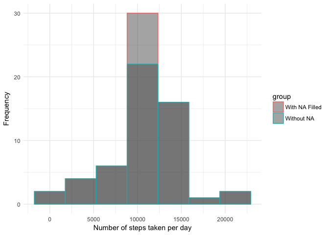

### Load the libraries

I've found lubridate and dplyr to be excellent libraries for working
with datasets. I use them very frequently in my work.

    library(lubridate)
    library(dplyr)
    library(ggplot2)

    ## Warning: package 'ggplot2' was built under R version 3.3.2

### Read the data

I read the data using the base function read.csv specifying that the
strings are not to be treated as factors.

    dat <- read.csv("activity.csv", stringsAsFactors = FALSE)

I transform the date from string to date class using dplyr and
lubridate. Using pipes makes everything very easy to manipulate and
read. I love you, dplyr.

    dat <- dat %>% mutate(date=ymd(date)) %>%
        mutate(steps=as.numeric(steps))

### What is mean total number of steps taken per day?

Create a total of steps for each day...

    dat_1 <- dat %>% group_by(date) %>% na.omit() %>% summarise(daily=sum(steps))

    print(dat_1)

    ## # A tibble: 53 × 2
    ##          date daily
    ##        <date> <dbl>
    ## 1  2012-10-02   126
    ## 2  2012-10-03 11352
    ## 3  2012-10-04 12116
    ## 4  2012-10-05 13294
    ## 5  2012-10-06 15420
    ## 6  2012-10-07 11015
    ## 7  2012-10-09 12811
    ## 8  2012-10-10  9900
    ## 9  2012-10-11 10304
    ## 10 2012-10-12 17382
    ## # ... with 43 more rows

and create a histogram.

    ggplot(dat_1, aes(x=daily)) +
        geom_histogram(bins=7, color="dodgerblue4", fill="dodgerblue4", alpha = 0.7) +
        labs(y="Frequency", x="Number of steps taken per day") +
        theme_minimal()

### What is the average daily activity pattern?

Create a mean of steps for each 5-min interval.

    dat_2 <- dat %>% group_by(interval) %>% na.omit() %>% summarise(steps=mean(steps))

Which 5-minute interval, on average across all the days in the dataset,
contains the maximum number of steps?

    ggplot(dat_2, aes(x=interval, y=steps)) +
        geom_line(color="dodgerblue4", size=0.5) +
        theme_minimal() +
        labs(x="5-minute interval", y="average steps")

### Imputing missing values

Calculate and report the total number of missing values in the dataset.

    sum(is.na(dat))

    ## [1] 2304

I created a new dataset that is equal to the original dataset but with
the missing data filled in. I filled the missing values with the mean
for the 5-min interval calculated in the previous step (dat\_2).

    dat_f <- left_join(dat, dat_2, by="interval") %>%
        mutate(steps.x = if_else(is.na(steps.x), steps.y, steps.x)) %>%
        select(steps.x, date, interval) %>%
        rename(steps=steps.x)

I created a data set analogous to dat\_1, which is a sum of the total
steps per day, but having filled the missing values with the mean for
the 5-min interval...

    dat_f_1 <- dat_f %>% group_by(date) %>% na.omit() %>% summarise(daily=sum(steps))

and generated the corresponding histogram.

    ggplot(dat_f_1, aes(x=daily)) +
        geom_histogram(bins=7, color="dodgerblue4", fill="dodgerblue4", alpha = 0.7) +
        labs(y="Frequency", x="Number of steps taken per day") +
        theme_minimal()

We can compare the histograms by overlaying them:

    dat_c_1 <- dat_1   %>% mutate(group = "Without NA")
    dat_c_2 <- dat_f_1 %>% mutate(group = "With NA Filled")

    dat_comp <- rbind(dat_c_1, dat_c_2)

    ggplot(dat_comp, aes(x=daily, color=group)) +
        geom_histogram(bins=7, alpha=0.5, position="identity") +
        labs(y="Frequency", x="Number of steps taken per day") +
        theme_minimal()

Calculate and report the mean and median total number of steps taken per
day. Do these values differ from the estimates from the first part of
the assignment? What is the impact of imputing missing data on the
estimates of the total daily number of steps?

    mean(dat_1$daily, na.rm=TRUE)

    ## [1] 10766.19

    median(dat_1$daily, na.rm=TRUE)

    ## [1] 10765

    mean(dat_f_1$daily, na.rm=TRUE)

    ## [1] 10766.19

    median(dat_f_1$daily, na.rm=TRUE)

    ## [1] 10766.19

Having introduced mean values, there is no shift in the mean value of
the filled distribution as compared to the set where the missing values
are removed. However, there is a change in the median value. In hte
filled data, the mean and the median are equal.

### Are there differences in activity patterns between weekdays and weekends?

I calculate the day of the week using lubridate wday (with labels) and
specifying whether the day is in the weekend or not.

    dat_w <- dat %>% mutate(Week.Day = wday(date, label=TRUE)) %>%
        mutate(Weekend = if_else(Week.Day %in% c('Sat','Sun'), "Weekend","Weekday")) %>%
        group_by(Weekend, interval) %>% summarise(steps=mean(steps, na.rm=TRUE))

And I compare the time series for the Weekend and Weekdays.

    ggplot(dat_w, aes(interval, y=steps, color=Weekend)) +
        geom_line(size=0.5) +
        theme_minimal() +
        theme(legend.title=element_blank()) +
        labs(x="5-minute interval", y="average steps")

It can be observed that there is less overall activity on the weekends.
However, on the weekends there is more activity in the afternoon hours
(3:30 - 5:30 pm).
